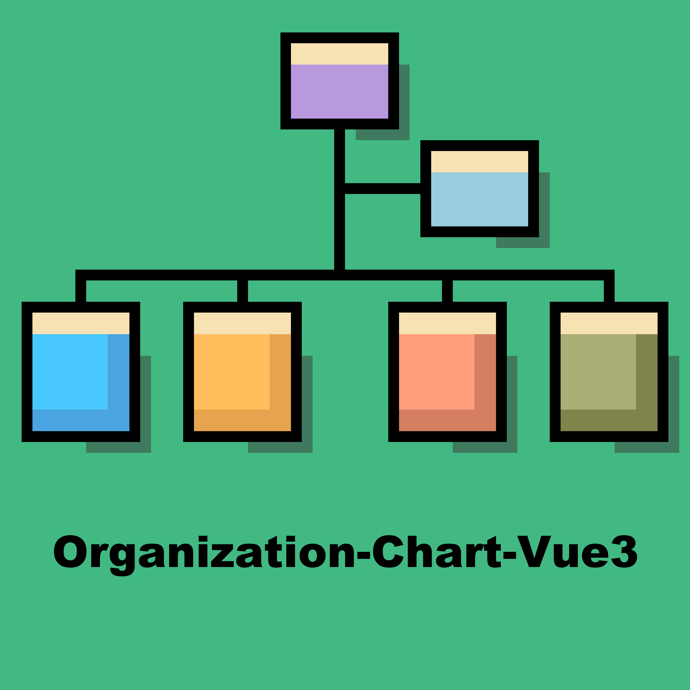

### [DEMO](https://leejams.github.io/Organization-Chart-Vue3/)

# Organization-Chart-Vue3

> A Vue3 component to display organization chart



## Install

```bash
npm i organization-chart-vue3 --save
```

## Usage

in template:

```html
<OrganizationChart :data="orgData" @click-node="clickNode" />
```

in script:

```js
import OrganizationChart from "organization-chart-vue3";
import "organization-chart-vue3/dist/style.css";

export default {
    components: {
        OrganizationChart
    },
    data() {
        return {
            orgData: {
                ...
            }
        }
    },
    ...
}
```

## Event

### Click (node)

```text
Click on the node triggered, receive the current node data as a parameter

If click on the title, you can get all the data of the node.
If click on the member, you can get the data of the member.
```

## Prop

### data

Component data to support those field：

```text
- title[String] to display a oraganization title
- member[String] to display a oraganization member
  - name[String] to display a organization member name
  - add[String] to display a organization member additonal info
  - image_url[String] to display a organization member image
- children[Array] to display a organization children
- titleClass[String, Array<String>] to input organization title class
- contentClass[String, Array<String>] to input organization content class
```

Example：

```js
const orgData = {
  title: "CEO",
  member: [
    {
      name: "Oliver",
      image_url:
        "https://github.com/LeeJams/LeeJams.github.io/blob/master/assets/img/user.jpg?raw=true",
    },
  ],
  children: [
    {
      title: "MANAGEMENT",
      member: [
        {
          name: "Jake",
          add: "Junior Staff",
          image_url:
            "https://github.com/LeeJams/LeeJams.github.io/blob/master/assets/img/user.jpg?raw=true",
        },
        {
          name: "Noah",
          add: "Senior Staff",
          image_url:
            "https://github.com/LeeJams/LeeJams.github.io/blob/master/assets/img/user.jpg?raw=true",
        },
        {
          name: "James",
          add: "Senior Manager",
          image_url:
            "https://github.com/LeeJams/LeeJams.github.io/blob/master/assets/img/user.jpg?raw=true",
        },
      ],
    },
    {
      title: "DEVELOPMENT",
      member: [
        {
          name: "Emma",
          add: "CTO",
          image_url:
            "https://github.com/LeeJams/LeeJams.github.io/blob/master/assets/img/user.jpg?raw=true",
        },
      ],
      children: [
        {
          title: "FRONTEND",
          titleClass: "frontend-title",
          contentClass: "frontend-content",
          member: [
            {
              name: "David",
              add: "Senior Staff",
            },
            {
              name: "Ava",
              add: "Senior Staff",
            },
            {
              name: "Sophia",
              add: "Senior Staff",
            },
          ],
        },
        {
          title: "BACKEND",
          titleClass: "backend-title",
          contentClass: "backend-content",
          member: [
            {
              name: "Kyle",
              add: "Senior Staff",
            },
            {
              name: "Richard",
              add: "Senior Staff",
            },
            {
              name: "Daniel",
              add: "Senior Staff",
            },
          ],
        },
      ],
    },
    {
      title: "DESIGN",
      member: [
        {
          name: "Jacob",
          add: "Senior Staff",
        },
      ],
    },
    {
      title: "MARKETING",
    },
    {
      title: "SALES",
      children: [
        {
          title: "SALES A TEAM",
        },
        {
          title: "SALES B TEAM",
        },
      ],
    },
  ],
};
```

```css
.backend-title {
  background-color: #66abd3;
  color: #fff;
}
.backend-content {
  text-align: center;
}
.frontend-title {
  background-color: #333;
  color: #fff;
}
.frontend-content {
  text-align: center;
}
/* Or you can use ::v-deep */
```

Copyright (c) 2023-present, [LeeJam](https://leejams.github.io/)
