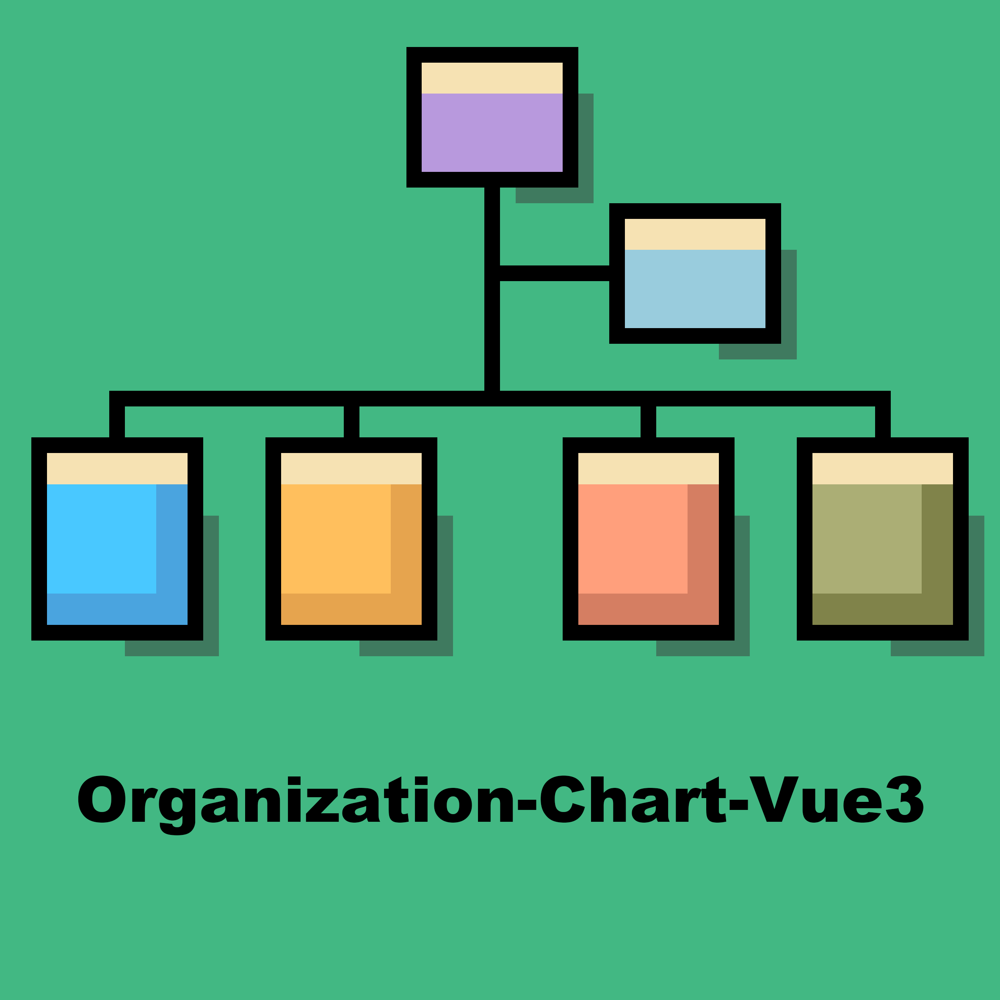

# Organization-Chart-Vue3

[](https://www.npmjs.com/package/organization-chart-vue3)

> A Vue3 component to display organization chart

## Live Demo

Try it here:

[Organization-Chart-Vue3 DEMO](https://leejams.github.io/Organization-Chart-Vue3/)



## Install

Minimum supported Vue version: `3.3.4`

```bash
npm i organization-chart-vue3
```

## Basic Usage

```vue
<template>
  <OrganizationChart
    :data="orgData"
    @click-node="handleLegacyClick"
    @select="handleSelect"
  />
</template>

<script>
import OrganizationChart from "organization-chart-vue3";
import "organization-chart-vue3/style.css";

export default {
  components: {
    OrganizationChart,
  },
  data() {
    return {
      orgData: {
        id: "company",
        title: "CEO",
        member: [
          {
            id: "oliver",
            name: "Oliver",
            add: "Chief Executive Officer",
          },
        ],
        children: [
          {
            id: "engineering",
            title: "Engineering",
            member: [
              {
                id: "emma",
                name: "Emma",
                add: "CTO",
              },
            ],
            children: [
              {
                id: "frontend",
                title: "Frontend",
              },
            ],
          },
        ],
      },
    };
  },
  methods: {
    handleLegacyClick(payload) {
      console.log("legacy click-node payload", payload);
    },
    handleSelect(payload) {
      console.log("typed select payload", payload);
    },
  },
};
</script>
```

## `script setup` + TypeScript

```vue
<template>
  <OrganizationChart :data="orgData" @select="handleSelect" />
</template>

<script setup lang="ts">
import OrganizationChart from "organization-chart-vue3";
import "organization-chart-vue3/style.css";
import type {
  OrganizationChartNode,
  OrganizationChartSelectPayload,
} from "organization-chart-vue3";

const orgData: OrganizationChartNode = {
  id: "company",
  title: "CEO",
  member: [
    {
      id: "oliver",
      name: "Oliver",
      add: "Chief Executive Officer",
    },
  ],
  children: [
    {
      id: "engineering",
      title: "Engineering",
      member: [
        {
          name: "Emma",
          add: "CTO",
        },
      ],
      children: [
        {
          id: "frontend",
          title: "Frontend",
        },
      ],
    },
  ],
};

function handleSelect(payload: OrganizationChartSelectPayload) {
  if (payload.kind === "member") {
    console.log("member selected", payload.member?.name);
    return;
  }

  console.log("node selected", payload.node.title);
}
</script>
```

## Event Payload

`select` is the recommended event. It emits a typed payload:

```ts
type OrganizationChartSelectPayload = {
  kind: "node" | "member";
  node: OrganizationChartNode;
  member?: OrganizationChartMember;
  id?: string;
  path: string[];
};
```

- Clicking a node title emits `{ kind: "node", node, id: node.id, path }`
- Clicking a member row emits `{ kind: "member", node, member, id, path }`
- `click-node` is still supported for backward compatibility and emits the raw node or member object

## Props

- `data`: `OrganizationChartNode`
- `defaultExpandAll?`: `boolean`
  Default is `true`

## Slots

- `node-title`
  Receives `{ node, depth, path }`
- `member`
  Receives `{ node, member, depth, path }`

Example:

```vue
<OrganizationChart :data="orgData">
  <template #node-title="{ node, depth }">
    <span>{{ depth + 1 }}. {{ node.title }}</span>
  </template>

  <template #member="{ member }">
    <div class="member-card">
      <strong>{{ member.name }}</strong>
      <span>{{ member.add }}</span>
    </div>
  </template>
</OrganizationChart>
```

## Data Shape

```ts
interface OrganizationChartMember {
  id?: string;
  name?: string;
  add?: string;
  image_url?: string;
}

interface OrganizationChartNode {
  id?: string;
  title: string;
  member?: OrganizationChartMember[];
  children?: OrganizationChartNode[];
  titleClass?: string | string[];
  contentClass?: string | string[];
}
```

`id` is optional, but recommended. It gives the chart stable keys for expand state and makes AI-generated data updates more predictable.

Copyright (c) 2023-present, [LeeJam](https://leejams.github.io/)
